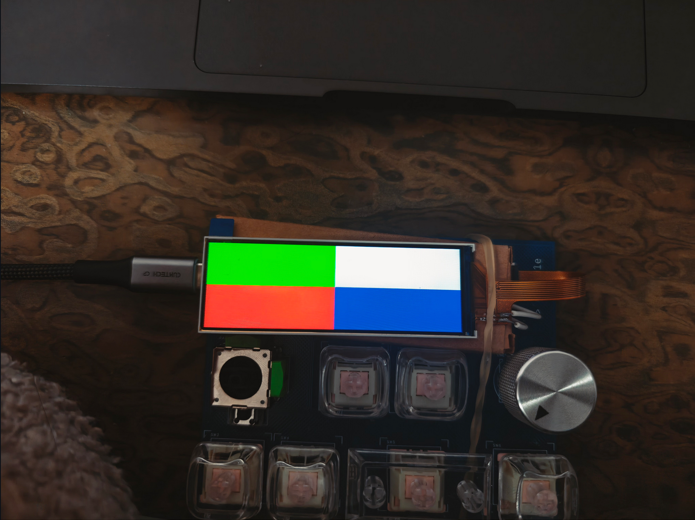

# micropython_nv3007
Datasheet: https://admin.osptek.com/uploads/NV_3007_Datasheet_V1_0_20240619_2_8a0a34f8c5.pdf  
根据商家给的stm32示例代码修改



## Files
- `nv3007.py` - 主驱动模块
- `example.py` - 使用示例程序
- `nv3007_test.py` - 简单测试程序（单文件版本）

## Quickstart
- 复制`nv3007.py`至您的mpy设备
- 修改接线
默认引脚配置：

| 屏幕引脚 | Pico2引脚 |
| -------- | --------- |
| BLK      | GP14      |
| RST      | GP21      |
| DC       | GP20      |
| SDA      | GP19      |
| SCL      | GP18      |
| CS       | GP17      |
| VCC      | 3.3V      |
| GND      | GND       |
- 运行`example.py`或`test.py`测试显示

## API Reference
### Initialization
1. 使用便捷函数（推荐）
```python
from nv3007 import create

# 使用默认配置创建实例
lcd = create()

# 清屏
lcd.clear()

# 绘制红色矩形
lcd.fill_rect(10, 10, 50, 50, NV3007.RED)

...
```

2. 手动配置
```python
from nv3007 import NV3007
from machine import SPI, Pin

# 创建SPI对象
spi = SPI(0, baudrate=8000000, polarity=1, phase=1, 
          bits=8, sck=Pin(18), mosi=Pin(19))

# 创建屏幕实例
lcd = NV3007(spi, cs=17, dc=20, rst=21, blk=14)

...
```

### 基础绘制函数

```python
# 清屏
lcd.clear(color=NV3007.WHITE)

# 画点
lcd.pixel(x, y, color)

# 画线
lcd.line(x1, y1, x2, y2, color)

# 空心矩形
lcd.rect(x, y, w, h, color)

# 实心矩形
lcd.fill_rect(x, y, w, h, color)

# 空心圆
lcd.circle(xc, yc, r, color)

# 实心圆
lcd.fill_circle(xc, yc, r, color)

# 三角形
lcd.triangle(x1, y1, x2, y2, x3, y3, color, filled=False)
```

### 控制函数

```python
# 设置背光 (0: 关, 1: 开)
lcd.set_backlight(1)

# 进入睡眠模式
lcd.sleep()

# 唤醒屏幕
lcd.wake()
```

### 预定义颜色

```python
NV3007.WHITE
NV3007.BLACK
NV3007.RED
NV3007.GREEN
NV3007.BLUE
NV3007.YELLOW
NV3007.CYAN
NV3007.MAGENTA
# ...
```

